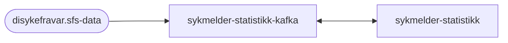
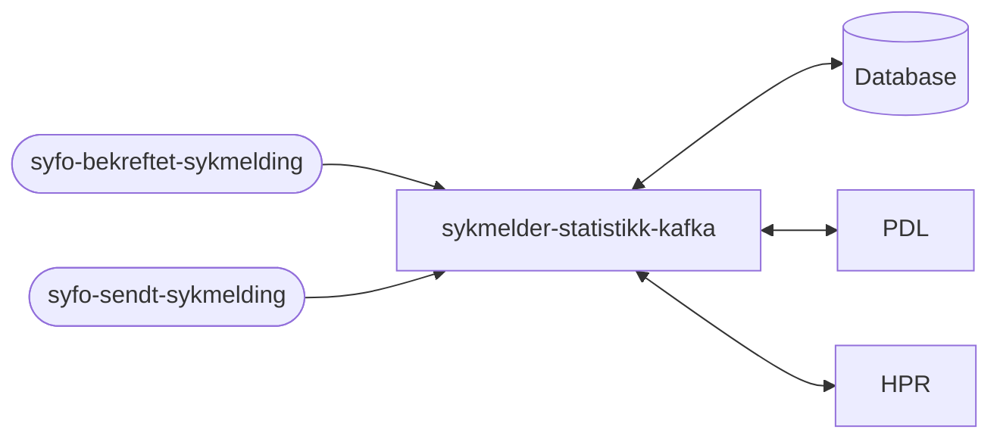

# sykmelder-statistikk-kafka 
Tool for sykmelder to compare their sick leave practice with that of others sykmeldere

## Technologies used
* Kotlin
* Ktor
* Gradle
* Junit
* Docker
* JDK 17

### Prerequisites
Make sure you have JDK installed using this command:
#### JDK 17
```bash script
java --version
```

#### Docker
Make sure you have docker installed using this command:
```bash script
docker --version
```


## FlowChart
This the high level flow of the application


Feature data flow?:


> **Internal note**
> Fra sykmeldingene trenger vi å lagre følgende:
> * densykmeldtes fnr
> * sykmelder fnr(den som signernern sykmeldingen)
> * fom og tom på sykmeldingen
> * Dersom flere perioder, og ulik sykmeldings grad, dele disse opp
> * Houveddiagnose
> Fra PDL trenger vi å lagre følgende:
> * den sykmeldtes geografiske tilhørighet
> * kommunenr
> * fylkesnr
> Fra HPR trenger vi å lagre følgende:
> * sykmelder godkjenninger verdi, eks LE,TL,MT,FT,KI, Vi veit ikkje hvilken av disse evt sykmelder benyttet under sykmeldingen...


## Getting started

### Building the application
#### Compile and package application
To build locally and run the integration tests you can simply run
``` shell
./gradlew shadowJar
```
or on windows
``` shell
gradlew.bat shadowJar
```

### Upgrading the gradle wrapper
Find the newest version of gradle here: https://gradle.org/releases/ Then run this command:
``` shell
./gradlew wrapper --gradle-version $gradleVersjon
```

### Swagger api doc
The Swagger api doc is available here
https://sykmelderstatistikkkafka.intern.dev.nav.no/swagger

### Contact

This project is maintained by [navikt/teamsykmelding](CODEOWNERS)

Questions and/or feature requests?
Please create an [issue](https://github.com/navikt/sykmelder-statistikk-kafka/issues)

If you work in [@navikt](https://github.com/navikt) you can reach us at the Slack
channel [#team-sykmelding](https://nav-it.slack.com/archives/CMA3XV997)
